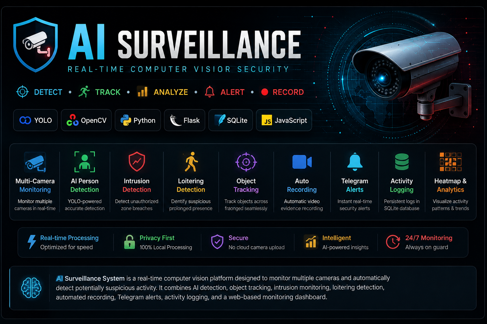

  

  <b>Real-time AI-powered multi-camera surveillance system</b>

  Detect • Track • Analyze • Alert • Record

---

# AI Surveillance System

> Real-time AI-powered multi-camera surveillance system with person detection, intrusion monitoring, loitering detection, automated recording, Telegram alerts, activity logging, and a web-based monitoring dashboard.

**YOLO • OpenCV • Python • Flask • SQLite • JavaScript**

---

## 🚨 Overview

AI Surveillance System is a real-time computer vision platform designed to monitor multiple camera feeds and automatically identify potentially suspicious activity.

The system combines AI-based person detection, object tracking, intrusion-zone monitoring, loitering detection, automated recording, Telegram notifications, persistent activity logging, and a web-based monitoring dashboard into a single surveillance pipeline.

### What it does

- 🎥 **Multi-Camera Monitoring** — Monitor multiple cameras simultaneously.
- 🧠 **AI Person Detection** — Detect people in real time using YOLO.
- 🎯 **Object Tracking** — Track detected people across frames.
- 🚨 **Intrusion Detection** — Detect when a person enters a configured restricted zone.
- 🚶 **Loitering Detection** — Identify people remaining in an area for an unusual duration.
- 🎬 **Automated Recording** — Automatically record relevant detection events.
- 📸 **Snapshots** — Capture frames during important events.
- 📱 **Telegram Alerts** — Send real-time surveillance notifications.
- 🗃️ **Activity Logging** — Persist intrusion events using SQLite.
- 📊 **Anomaly Detection** — Compare activity against historical time-of-day patterns.
- 🖥️ **Web Dashboard** — Monitor camera status, detections, recordings, and events in real time.
- 🌡️ **Heatmap Visualization** — Visualize spatial activity within camera feeds.

The architecture is designed so that the camera-processing layer, API layer, activity logging system, and dashboard remain separated, making the system easier to extend with additional cameras and detection capabilities.

---

## ✨ Key Features

- 🎥 **Multi-Camera Surveillance**
- 🤖 **YOLO-Based Person Detection**
- 🎯 **Intrusion Zone Detection**
- 🚶 **Loitering Detection**
- 🧭 **Object Tracking**
- 🔴 **Automatic Video Recording**
- 📸 **Snapshot Capture**
- 📱 **Telegram Security Alerts**
- 📊 **Real-Time Web Dashboard**
- 🗃️ **Persistent Activity Logging**
- 🔥 **Activity Heatmap**
- ⏱️ **Time-of-Day Anomaly Detection**
- 🖥️ **Live Camera Monitoring**
- ⚡ **Real-Time Camera Metrics**

---

## 🧠 Core Technologies

| Category | Technology |
|---|---|
| Programming Language | Python |
| Computer Vision | OpenCV |
| Object Detection | Ultralytics YOLO |
| Object Tracking | ByteTrack |
| Backend API | Flask |
| Database | SQLite |
| Frontend | HTML, CSS, JavaScript |
| Notifications | Telegram Bot API |
| Version Control | Git / GitHub |

---
